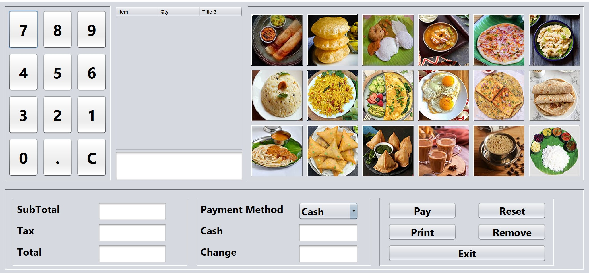

# PointOfSale

# Project Documentation

<p align="center">
  <a href="" rel="noopener">
 </a>
</p>


<h3 align="center">Point of Sale</h3>

<div align="center">

  []() 
  [](https://github.com/akshayandy/PointOfSale/issues)
  [](https://github.com/akshayandy/PointOfSale/issues)
  [](/LICENSE)

</div>

---

## 📝 Table of Contents
- [About](#about)
- [Getting Started](#getting_started)
- [Deployment](#deployment)
- [Usage](#usage)
- [Built Using](#built_using)
- [Authors](#authors)
- [Acknowledgments](#acknowledgement)

## 🧐 About <a name = "about"></a>
The point of sale (POS) application developed using Netbeans is a comprehensive solution designed to meet the needs of businesses looking for a reliable and user-friendly platform for managing their sales transactions. The application offers a range of functionalities, including adding items, calculating the total, subtotal, tax, change, and payment method. It also includes a numpad for easy entry of amounts, clear, reset, pay, print, and exit options to streamline the checkout process. The application is designed to be simple and intuitive, with a clean and modern user interface, making it easy for users to navigate and operate. This POS application is an excellent choice for businesses looking for an efficient and robust sales management solution. I took almost 10 hrs to complete this project. SkillLync helped me by providing the wire-frames for all relevant feature pages

## 🏁 Getting Started <a name = "getting_started"></a>
These instructions will get you a copy of the project up and running on your local machine for development and testing purposes. See [deployment](#deployment) for notes on how to deploy the project on a live system.

### Prerequisites
You need Apache Netbeans software to work on this project.
Go to google and search,

```
Apache NetBeans download, download the exe file.
```

### Installing
After downloading run the exe file.

The inatallation is simple and easy. same as eclipse.

```
After checking all the necessary tools are opted.Click install.
```

After the progress is done to 100
%

```
Click Finish.
```

In my machine I've used Apache NetBeans version 16.

## 🔧 Running the tests <a name = "tests"></a>
This project can be tested by simply clicking run. As this doesnot require any servers.

### Break down into end to end tests
This tests are simply run and play with it.

```
Click run and test all the features.
```

## 🎈 Usage <a name="usage"></a>
After running the application. Add item by clicking the icons of items. User can see the total and sub total. Can change the payment method and can pay and print.

## 🚀 Deployment <a name = "deployment"></a>
This application does not require any live server. This is a local machhine application.

## ⛏️ Built Using <a name = "built_using"></a>
- [Apache NetBeans](https://netbeans.apache.org/) - Apache NetBeans

## ✍️ Authors <a name = "authors"></a>
- [@akshayandy](https://github.com/akshayandy) - FSD

## 🎉 Acknowledgements <a name = "acknowledgement"></a>
- @Dj Oamen
